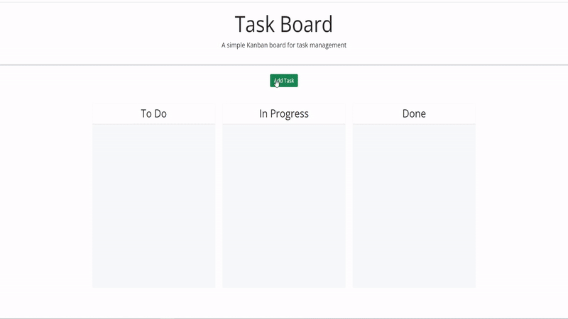

# Taskboard

Here is a Task Manager Board, where you can add your tasks to this board, organised them into a 'To Do', 'In Progress' and 'Done' statuses to keep track.

You can apply due dates for the tasks to help manage when your tasks are to be completed by.

If you no longer want a task on the board, you can simply click the delete button to remove the task.

[Click Here](https://CinosMagician.github.io/taskboard) to view the live webpage

## Usage

Clicking on the 'Add Task' button, you are met with a pop-up window, where you are prompted to enter in a title for your task* a Description to help discribe the task, and a Due Date that includes a date picker*

Once you have entered in your information, the task will be generated and added to the "To Do" section. Depending on the due date, the task will change color. If the task is overdue, it will have a red colorscheme. If it is due within the next 2 days (including today), it will appear as yellow. Otherwise it will appear as grey, along with any tasks in the "Done" section will also turn grey.

Tasks can be dragged across to any column at any time, Just drop them into the column, if they are dropped elsewhere, they will return to where they just were.

Below is a demonstration of what you will expect for the webpage:

## License

[MIT](https://choosealicense.com/licenses/mit/)
